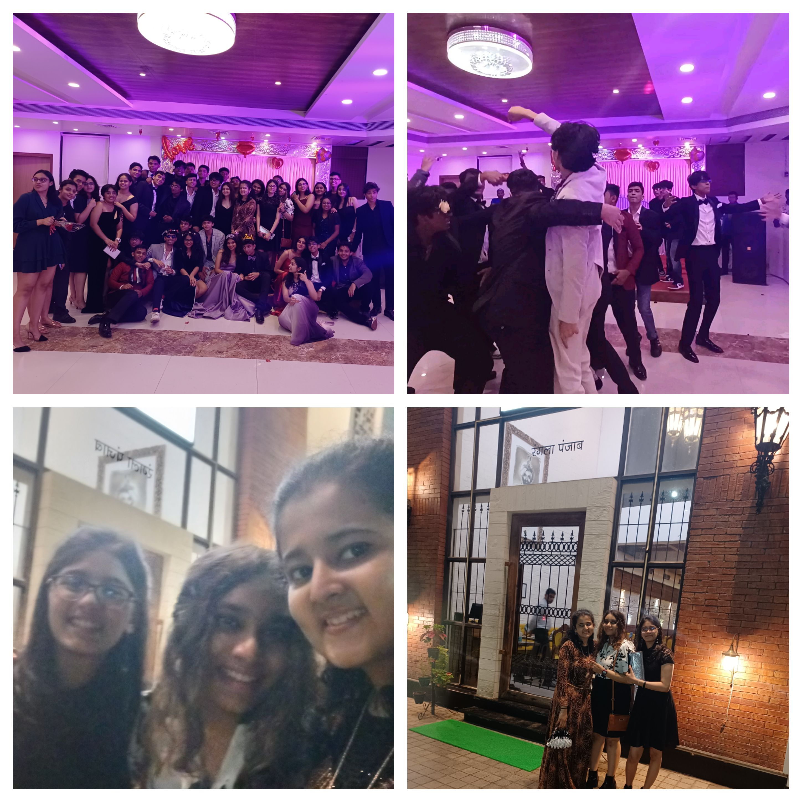
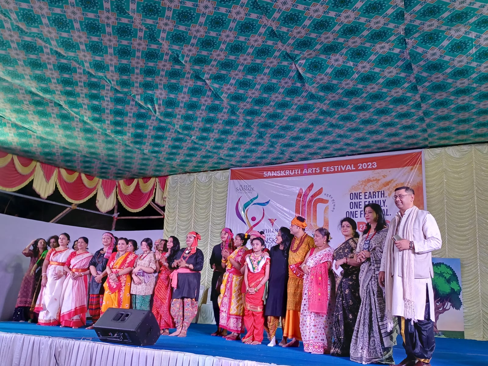
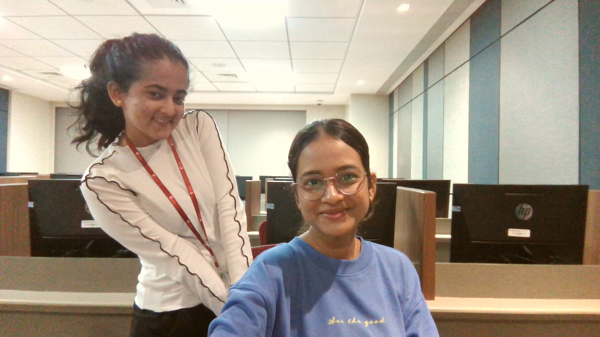
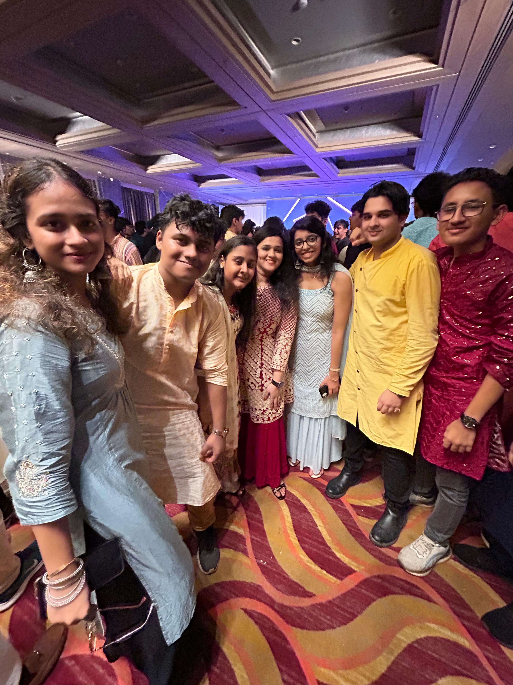

## Luxury Tailoring Boutique & Designer Studio, Thane



---

## Table of Contents

- About
- Features
- Gallery (sample)
- How to view
- Contributors
- Contact

---

## About

Tailoring Traditions is a luxury women-owned tailoring and designer studio based in Thane. We create bespoke garments that blend traditional craftsmanship with contemporary design.

### Specialty Services

- Luxury tailoring and custom-fitted garments
- Bespoke designer blouses and bridal couture
- Traditional saree styling and alterations
- Personalized consultations and styling guidance

---

## Key Features

- Responsive, lightweight HTML/CSS site
- Elegant, luxury-oriented visual design
- Gallery showcasing tailoring and finished pieces

---

## Gallery (sample)

Below are a few representative images from the `images/` folder. See the `images/` directory for the full collection.






---

## How to view locally

1. Open the project folder in your browser or a local server.
2. Open `Tailoring_Traditions.html` in your web browser to view the site.

For a quick local server (Python 3):

```bash
python -m http.server 8000
# then open http://localhost:8000/Tailoring_Traditions.html
```

---

## Contributors

- Kanishka Gole — knishkag2020@gmail.com — https://github.com/KanishkaGole
- Shivank Gole — shivanktuition@gmail.com

If you'd like to contribute updates to the README only, open a PR or contact the maintainers above.

---

## Contact

For inquiries, custom orders, or collaborations:

- Email: knishkag2020@gmail.com
- GitHub: https://github.com/KanishkaGole

---

## Notes

- No project source files were modified — only the README was added/updated.
- Images referenced are included in the `images/` folder.

---

Made with ❤️ by the Tailoring Traditions team
