# 🧵 Tailoring Traditions

## Luxury Tailoring Boutique & Designer Studio
### Based in Thane, Maharashtra | Est. 2019

---

## Table of Contents

1. [About Us](#about-us)
2. [Our Expertise](#our-expertise)
3. [Services](#services)
4. [Gallery & Portfolio](#gallery--portfolio)
5. [Why Choose Us](#why-choose-us)
6. [Project Details](#project-details)
7. [Contributors](#contributors)
8. [Contact & Inquiries](#contact--inquiries)

---

## About Us

**Tailoring Traditions** is a premier, women-owned luxury tailoring and designer studio that celebrates the art of bespoke craftsmanship. We blend traditional tailoring techniques with contemporary design aesthetics to create garments that tell your story.

Our studio in Thane has been serving discerning clients who appreciate quality, elegance, and personalized service. Every stitch reflects our commitment to excellence and attention to detail.

### Our Philosophy

> *"Where tradition meets innovation — every garment is a masterpiece."*

We believe that fashion should be personal, timeless, and beautifully crafted. Our approach combines:
- **Traditional Craftsmanship** — Time-honored tailoring techniques
- **Contemporary Design** — Modern aesthetics and trends
- **Personalized Service** — Custom solutions tailored to YOU

---

## Our Expertise

### Luxury Tailoring
Custom-fitted garments that celebrate your unique silhouette. From casual wear to formal occasions, we create pieces that fit perfectly and feel luxurious.

### Bespoke Designer Blouses
Intricately designed blouses tailored to your specifications. Whether traditional or modern, our designer blouses are statement pieces that elevate any wardrobe.

### Bridal Couture
Your special day deserves nothing but perfection. Our bridal collection features exquisite designs with meticulous embroidery and premium fabrics.

### Traditional Sarees
A curated selection of premium sarees paired with expert draping consultations. We help you find the perfect saree that complements your style.

### Styling & Consultation
Professional styling guidance to help you discover your personal aesthetic. Our experts provide personalized recommendations based on your preferences and lifestyle.

### Custom Designer Wear
From concept to creation, we transform your ideas into wearable art. Custom dresses, ethnic wear, and fusion designs crafted to your vision.

---

## Services

### 1️⃣ Tailoring Services
- **Custom Fitting** — Perfectly fitted garments
- **Alterations** — Expert hemming and adjustments
- **Resizing** — Transform existing pieces

### 2️⃣ Design Services
- **Custom Designs** — Original creations from scratch
- **Design Consultation** — Collaborate with our design team
- **Fabric Selection** — Guidance on premium fabrics

### 3️⃣ Bridal & Special Occasions
- **Bridal Wear** — Wedding and engagement outfits
- **Wedding Party Wear** — Coordinated looks for guests
- **Festival Wear** — Festive and celebration attire

### 4️⃣ Consultation Services
- **Styling Sessions** — Personal style assessment
- **Color Consultation** — Find your perfect colors
- **Wardrobe Planning** — Build a cohesive wardrobe

---

## Gallery & Portfolio

### Luxury Collections

*Exquisite bridal wear featuring intricate embroidery and premium fabrics*

*Close-up showcasing our attention to detail and quality craftsmanship*

*Curated collection of premium designs*

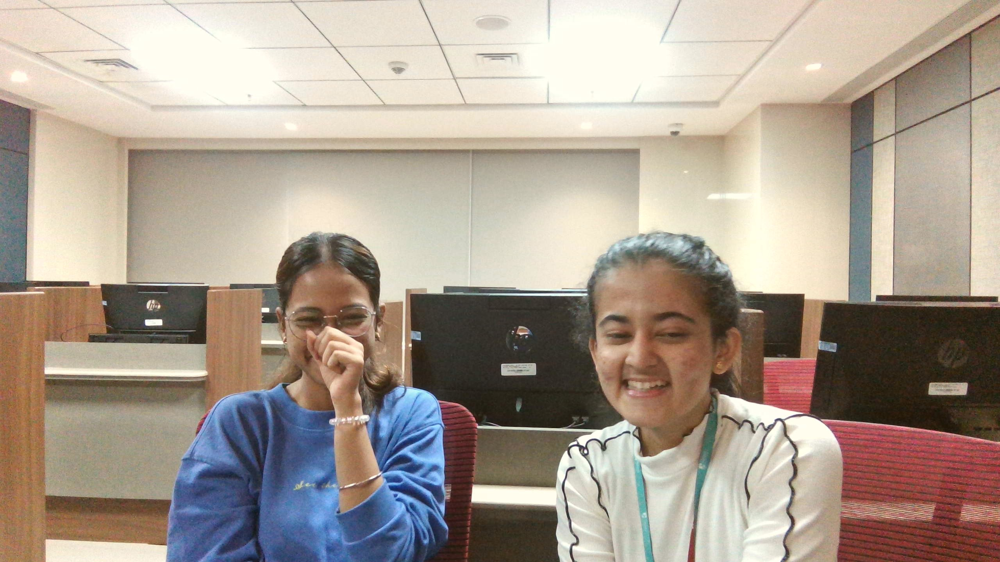
*Handcrafted pieces from our studio*

### Recent Client Collections

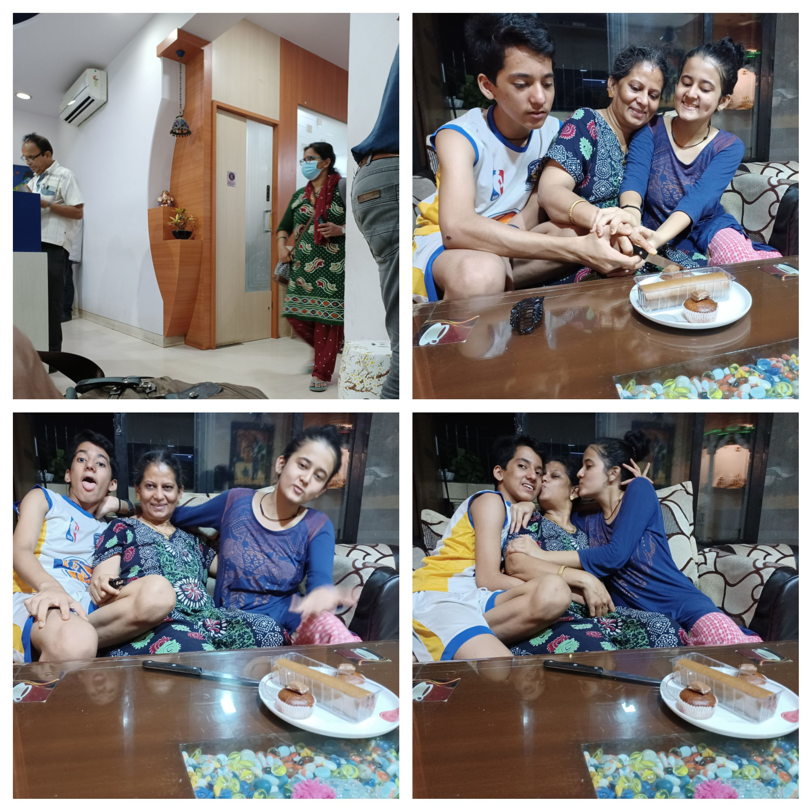

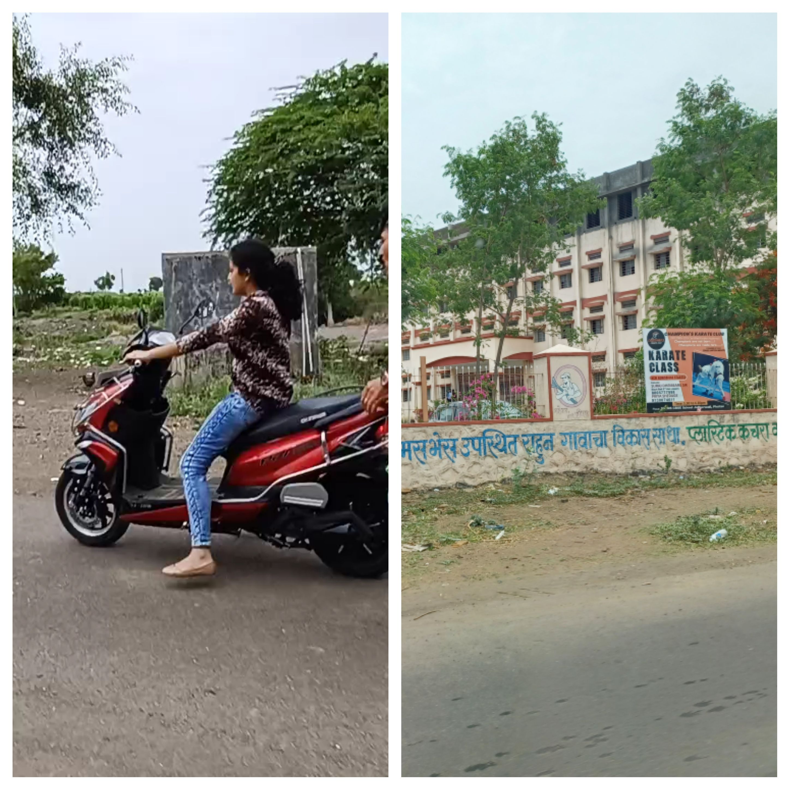

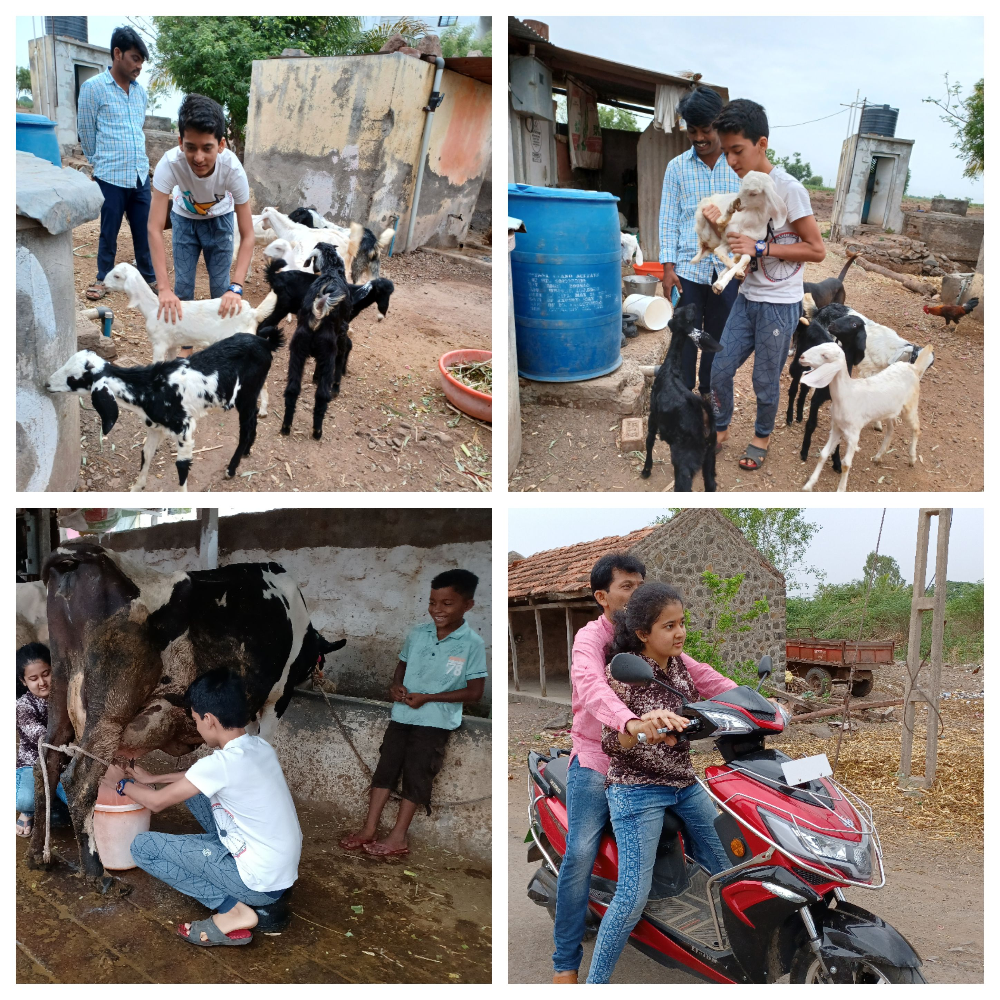

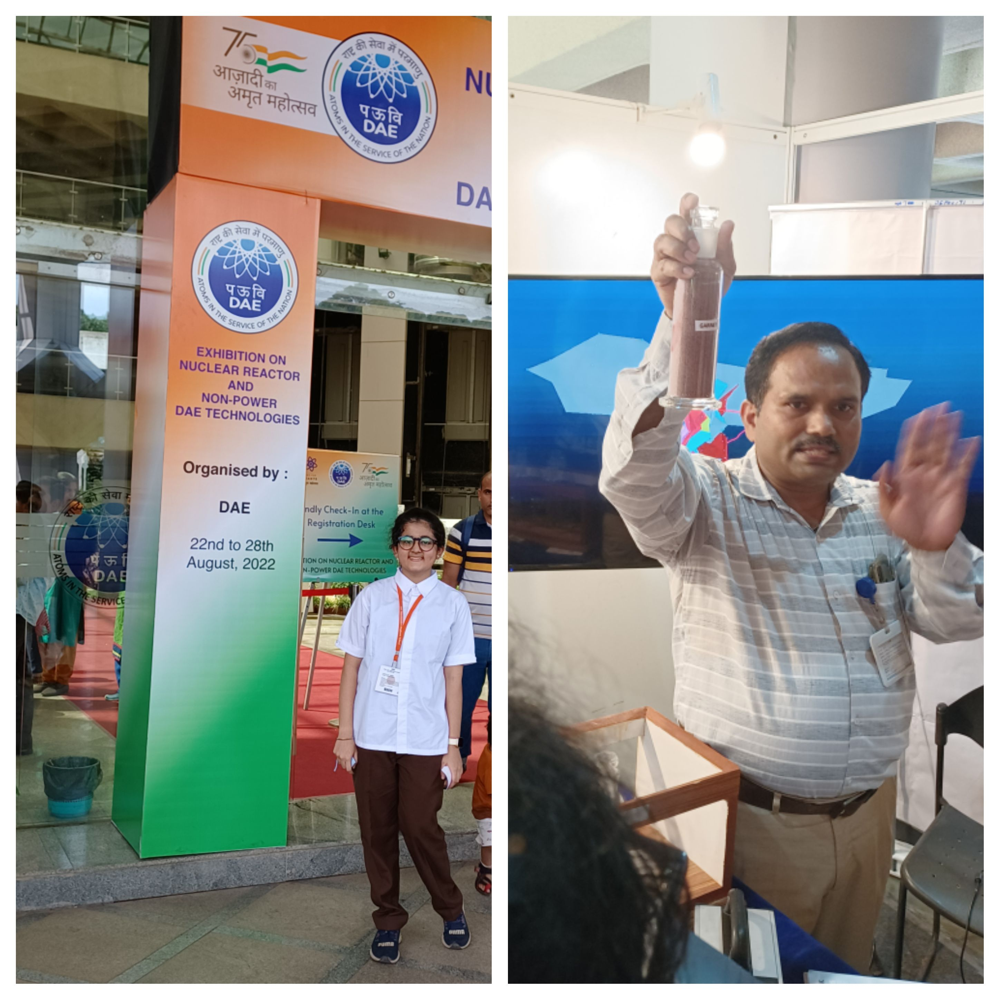

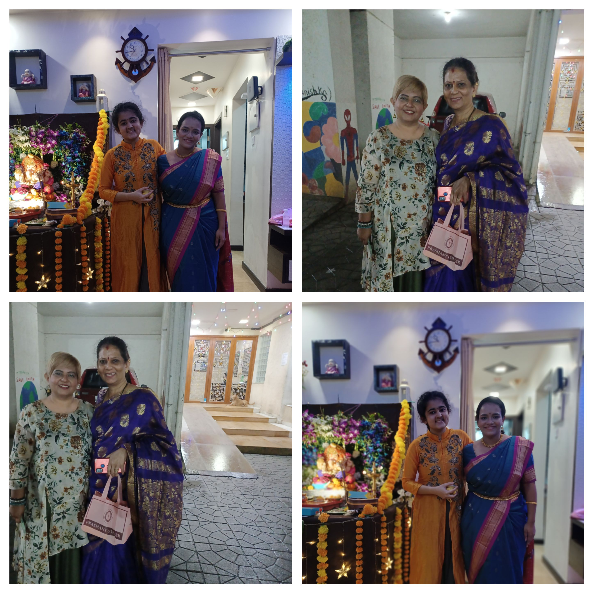

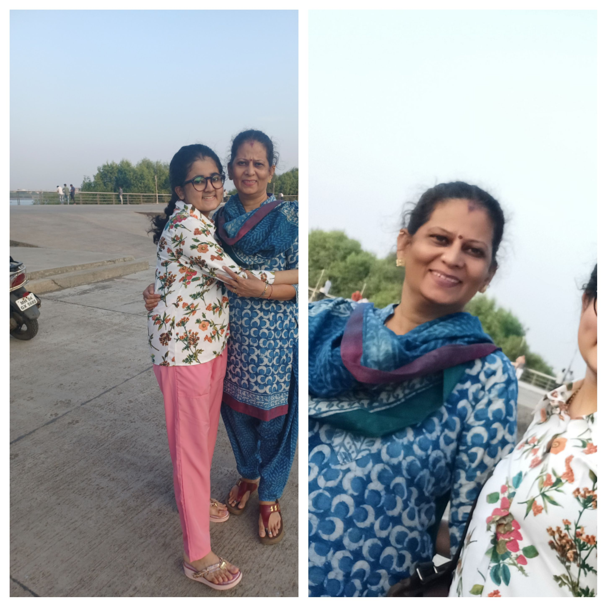

### Studio Highlights

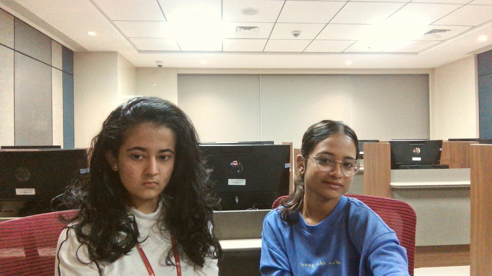

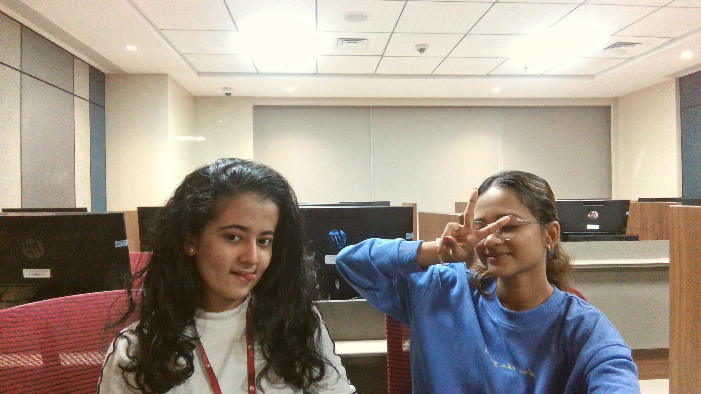

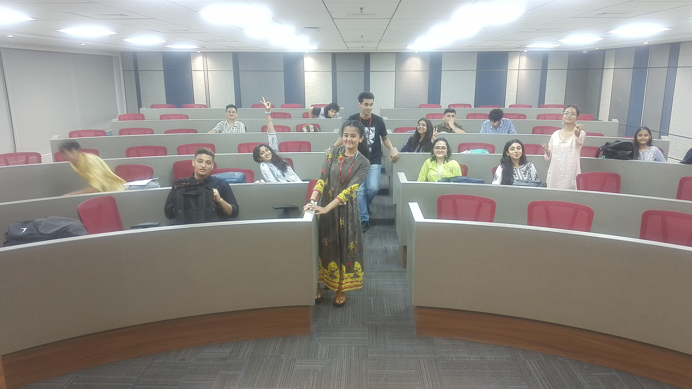

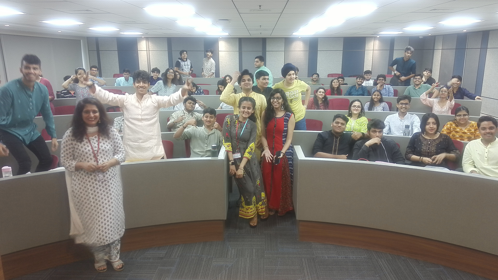

---

## Why Choose Us

### ✨ Quality First
We use only premium fabrics and materials sourced from trusted suppliers. Every piece is crafted with meticulous attention to detail.

### 🎯 Custom Tailored
No two clients are the same. We create personalized solutions that reflect your unique style, body type, and preferences.

### 👥 Expert Team
Our team of experienced designers and tailors brings years of expertise and passion for their craft.

### 💎 Luxury Experience
From consultation to final fitting, we provide a premium, personalized experience.

### ⏱️ Timely Delivery
We respect your time and deliver quality work within agreed timelines.

### 🤝 Client Relationships
We build lasting relationships with our clients, understanding their needs and preferences over time.

---

## Project Details

### Website Information

This is the official digital presence of **Tailoring Traditions**, built to showcase our portfolio, services, and craftsmanship.

#### Technology Stack
- **Frontend**: HTML5, CSS3
- **Design**: Luxury-focused color palette with premium typography
- **Typography**:
  - Cormorant Garamond (Serif) — Elegant headings
  - Jost (Sans-serif) — Clean, modern body text
- **Features**:
  - Responsive design across all devices
  - Beautiful gallery showcase
  - Intuitive user interface
  - Premium aesthetic

#### Key Features
- 📱 **Responsive Design** — Looks perfect on mobile, tablet, and desktop
- 🎨 **Elegant Aesthetics** — Luxury color palette (gold, emerald, ivory)
- 🖼️ **Portfolio Gallery** — Comprehensive showcase of our work
- 🧭 **Easy Navigation** — Intuitive interface for browsing

---

## Contributors

### Kanishka Gole
- **Role**: Founder & Designer
- **Email**: [knishkag2020@gmail.com](mailto:knishkag2020@gmail.com)
- **GitHub**: [@KanishkaGole](https://github.com/KanishkaGole)

### Shivank Gole
- **Role**: Co-Founder & Creative Lead
- **Email**: [shivanktuition@gmail.com](mailto:shivanktuition@gmail.com)

---

## Contact & Inquiries

### Get in Touch

We'd love to hear from you! Whether you're interested in our services, have custom design ideas, or want to collaborate, reach out to us.

📧 **Email**: knishkag2020@gmail.com
📱 **Alternative Contact**: shivanktuition@gmail.com
🌐 **GitHub**: [@KanishkaGole](https://github.com/KanishkaGole)
📍 **Location**: Thane, Maharashtra

### Service Inquiries
- Custom tailoring & fitting
- Bespoke designer wear
- Bridal couture
- Styling consultation
- Bulk orders & corporate wear

---

## 🔗 Project Repository

View the full project source code and assets:
- **GitHub Repository**: [https://github.com/KanishkaGole/Tailoring_Traditions](https://github.com/KanishkaGole/Tailoring_Traditions)

---

## Notes

- All images are sourced from our studio and client collections
- No project source files were modified — only documentation added
- High-resolution images available in the `images/` folder
- Website file: `Tailoring_Traditions.html`

---

## License

This project and all content (images, designs, text) are the intellectual property of **Tailoring Traditions**. All rights reserved.

---

## Acknowledgments

Special thanks to:
- All our valued clients who trust us with their special moments
- Our talented team of artisans and designers
- The supportive community in Thane
- Everyone who believes in the art of craftsmanship

---

**Made with ❤️ by the Tailoring Traditions Team**

*Celebrating the art of tailoring, one garment at a time.*
